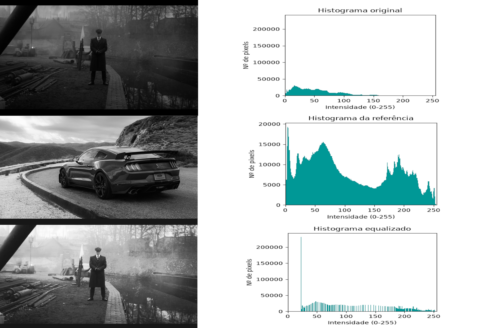

# EqualiHist Do

* Ferramenta para vizualizar histogramas e equalizar imagens
* Trabalha apenas com escala de cinza
### Exemplo:
Equalização 

  
Equalização Especifica 

 
### Instruções
#### Fluxo de uso:
1 Carregue a imagem original (jpg, jpeg, png ou bmp), se ela for colorida será transformada em escala de cinza 
2 Aperte o botão "Gerar Histograma" para gerar o histograma dela 
3 Aperte o botão "Equalizar" para equalizar 
4 Se quiser comparar a imagem e histogramas originais aperte em comparar 
5 Se quiser salvar, aperte o botão de salvar no canto superior direito 
  
A interface de Equalização Específica pode ser acessada por um botão no canto inferior direito 
1 Carregue a imagem original e a imnagem referência (seu histograma será considerado como referência para equalização da imagem original) 
2 Aperte o botão "Equalização Específica" para equalizar 
3 Se quiser salvar, aperte o botão de salvar no canto superior direito 